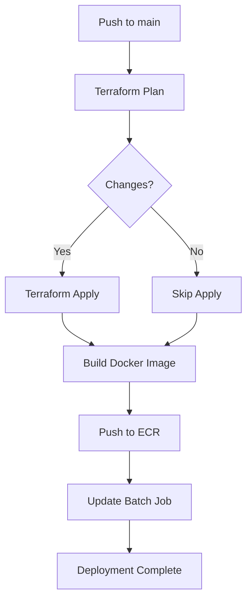
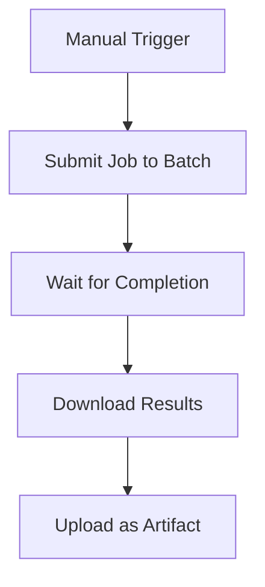

# 🚀 Deployment Guide - GitHub Actions + AWS

Complete guide to deploy the AI Music Generator with automatic CI/CD.

---

## ✅ What Was Done

### 1. GitHub Actions Workflows Created

**`.github/workflows/deploy-aws.yml`** - Automatic Deployment
- Triggers on push to `main` branch
- Plans and applies Terraform changes
- Builds and pushes Docker image to ECR
- Updates AWS Batch job definition

**`.github/workflows/test-deployment.yml`** - Test Deployment
- Manual trigger only
- Submits test job to AWS Batch
- Downloads and uploads results

**`.github/workflows/destroy-infrastructure.yml`** - Destroy Infrastructure
- Manual trigger with confirmation
- Empties S3 bucket
- Deletes ECR images
- Destroys all Terraform resources

### 2. AWS Infrastructure (Terraform)

**`terraform/main.tf`** - Complete infrastructure:
- AWS Batch compute environment (GPU Spot instances)
- AWS Batch job queue and definition
- S3 bucket for outputs
- ECR repository for Docker images
- IAM roles and policies
- CloudWatch log groups
- Security groups

### 3. Docker Image

**`Dockerfile`** - Production-ready image:
- Base: NVIDIA CUDA 11.8 + cuDNN 8
- PyTorch 2.1 with GPU support
- All AI models (MusicGen, Stable Diffusion)
- FFmpeg for video creation
- Optimized with `.dockerignore`

### 4. AWS Batch Worker

**`aws_batch_worker.py`** - Job processor:
- Processes jobs from AWS Batch
- Generates music with AI
- Creates cover images
- Combines into video
- Uploads results to S3

### 5. Job Submission CLI

**`aws_submit_job.py`** - Submit jobs:
- CLI to submit jobs to AWS Batch
- Supports all presets and models
- Can wait for completion
- Downloads results

### 6. Documentation

- **`docs/GITHUB_ACTIONS_SETUP.md`** - Complete GitHub Actions setup
- **`docs/AWS_SETUP.md`** - Manual AWS setup
- **`docs/AWS_PRICING.md`** - Detailed pricing analysis
- **`README.md`** - Updated with GitHub Actions info
- **`QUICKSTART_AWS.md`** - 5-minute quick start

---

## 🎯 Next Steps

### Step 1: Configure GitHub Secrets

Go to your repository on GitHub:

```
Settings > Secrets and variables > Actions > New repository secret
```

Add these 3 secrets:

| Secret Name | Value | Where to Get |
|-------------|-------|--------------|
| `AWS_ACCESS_KEY_ID` | Your AWS access key | IAM Console > Users > Security credentials |
| `AWS_SECRET_ACCESS_KEY` | Your AWS secret key | IAM Console > Users > Security credentials |
| `S3_BUCKET_NAME` | Unique bucket name | Choose: `your-name-ai-music-2026` |

**Important**: 
- The IAM user needs permissions for: Batch, ECR, S3, IAM, EC2, Logs
- The S3 bucket name must be globally unique

📖 **Detailed guide**: [docs/GITHUB_ACTIONS_SETUP.md](docs/GITHUB_ACTIONS_SETUP.md)

### Step 2: Trigger Deployment

The code is already pushed to GitHub. Now:

1. **Go to Actions tab** in your repository
2. **Click on "Deploy to AWS"** workflow
3. **Click "Run workflow"** button
4. **Select branch**: main
5. **Click "Run workflow"**

Or simply push any change to `main` branch:

```bash
git commit --allow-empty -m "Trigger deployment"
git push origin main
```

### Step 3: Monitor Deployment

1. Go to **Actions** tab
2. Click on the running workflow
3. Watch the progress:
   - ✅ Terraform Plan (~2 min)
   - ✅ Terraform Apply (~5 min)
   - ✅ Build & Push Docker (~10 min)

**Total time**: ~15-20 minutes for first deployment

### Step 4: Test Deployment

After deployment completes:

**Option A: Using GitHub Actions**
1. Go to **Actions** > **Test Deployment**
2. Click **Run workflow**
3. Enter:
   - Prompt: `cozy lofi coffee shop music`
   - Duration: `30`
   - Preset: `balanced`
4. Click **Run workflow**
5. Wait for completion (~5 min)
6. Download results from **Artifacts**

**Option B: Using CLI**
```bash
# Install dependencies
pip install -r requirements-aws.txt

# Submit job
python aws_submit_job.py \
  --prompt "cozy lofi coffee shop music" \
  --duration 30 \
  --preset balanced \
  --output-bucket YOUR-BUCKET-NAME \
  --wait

# Download result
aws s3 cp s3://YOUR-BUCKET-NAME/output/JOB_ID/video.mp4 ./
```

---

## 📊 What Happens on Each Push

### Automatic Workflow (Push to main)



### Manual Test Workflow



---

## 💰 Cost Breakdown

### GitHub Actions (FREE)
- **Public repos**: 2,000 minutes/month free
- **Private repos**: 3,000 minutes/month free (Pro)
- **Each deployment**: ~15 minutes
- **Monthly deployments**: ~130 free deployments

### AWS Costs

**Per Video**:
- Compute (g4dn.xlarge Spot): $0.017
- Storage (S3): $0.002
- Transfer: $0.001
- **Total**: ~$0.02

**Monthly** (10 videos/day):
- Compute: ~$5
- Storage: ~$1
- Transfer: ~$0
- **Total**: ~$6/month

**Infrastructure** (always running):
- S3 bucket: $0
- ECR repository: $0
- Batch (idle): $0
- CloudWatch logs: ~$0.50/month
- **Total**: ~$0.50/month

---

## 🔧 Configuration

### Change AWS Region

Edit `.github/workflows/deploy-aws.yml`:

```yaml
env:
  AWS_REGION: us-west-2  # Change from us-east-1
```

Also update `terraform/terraform.tfvars`:

```hcl
aws_region = "us-west-2"
```

### Use Different Instance Types

Edit `terraform/main.tf`:

```hcl
instance_types = [
  "g4dn.xlarge",    # $0.526/hour - 1 GPU
  "g4dn.2xlarge",   # $0.752/hour - 1 GPU, more RAM
  "g5.xlarge",      # $1.006/hour - Better GPU
]
```

### Change to On-Demand Instances

Edit `terraform/main.tf`:

```hcl
compute_resources {
  type = "EC2"  # Change from "SPOT"
  # Remove: bid_percentage
}
```

**Note**: On-Demand is 2-3x more expensive but never interrupted.

---

## 🐛 Troubleshooting

### Workflow fails at "Terraform Plan"

**Cause**: Missing or invalid AWS credentials

**Solution**:
1. Check GitHub secrets are set correctly
2. Verify IAM user has required permissions
3. Check AWS region matches

### Workflow fails at "Terraform Apply"

**Cause**: S3 bucket name already exists

**Solution**:
1. Change `S3_BUCKET_NAME` secret to a unique name
2. Re-run workflow

### Workflow fails at "Build Docker"

**Cause**: ECR repository doesn't exist yet

**Solution**:
1. Wait for Terraform Apply to complete first
2. Or create ECR repository manually:
```bash
aws ecr create-repository --repository-name ai-music-generator
```

### Test job fails

**Cause**: Infrastructure not deployed or outdated

**Solution**:
1. Run "Deploy to AWS" workflow first
2. Wait for completion
3. Then run "Test Deployment"

### Job stuck in RUNNABLE

**Cause**: EC2 instances launching

**Solution**:
- Wait 2-3 minutes for first job
- Subsequent jobs are faster

---

## 📊 Monitoring

### GitHub Actions

**View workflow runs**:
```
Actions > [Workflow name] > [Run]
```

**View logs**:
```
Actions > [Workflow] > [Job] > [Step]
```

### AWS Batch

**View jobs**:
```bash
aws batch list-jobs --job-queue ai-music-generator-queue --job-status RUNNING
```

**View logs**:
```bash
aws logs tail /aws/batch/ai-music-generator --follow
```

**CloudWatch Console**:
```
https://console.aws.amazon.com/cloudwatch/home#logsV2:log-groups
```

### Costs

**AWS CLI**:
```bash
aws ce get-cost-and-usage \
  --time-period Start=2026-02-01,End=2026-02-28 \
  --granularity MONTHLY \
  --metrics BlendedCost
```

**AWS Console**:
```
https://console.aws.amazon.com/billing/home#/
```

---

## 🔒 Security Best Practices

### 1. Use Least Privilege IAM

Don't use `AdministratorAccess`. Create custom policy:

```json
{
  "Version": "2012-10-17",
  "Statement": [
    {
      "Effect": "Allow",
      "Action": [
        "batch:*",
        "ecr:*",
        "s3:*",
        "iam:*",
        "ec2:*",
        "logs:*",
        "sts:GetCallerIdentity"
      ],
      "Resource": "*"
    }
  ]
}
```

### 2. Rotate Access Keys

Every 90 days:
```bash
aws iam create-access-key --user-name github-actions-user
# Update GitHub secrets
aws iam delete-access-key --access-key-id OLD_KEY
```

### 3. Enable Branch Protection

```
Settings > Branches > Add rule
- Require pull request reviews
- Require status checks to pass
```

### 4. Review Workflow Runs

Regularly check Actions tab for unusual activity.

---

## 🎉 Success Checklist

- [ ] GitHub secrets configured
- [ ] Pushed to main branch
- [ ] Deployment workflow completed
- [ ] Test job submitted and completed
- [ ] Video downloaded successfully
- [ ] Costs monitored
- [ ] Documentation read

---

## 📚 Additional Resources

- [GitHub Actions Documentation](https://docs.github.com/en/actions)
- [AWS Batch Documentation](https://docs.aws.amazon.com/batch/)
- [Terraform AWS Provider](https://registry.terraform.io/providers/hashicorp/aws/latest/docs)
- [Docker Documentation](https://docs.docker.com/)

---

## 🎯 What's Next?

1. ✅ Configure GitHub secrets
2. ✅ Trigger deployment
3. ✅ Monitor in Actions tab
4. ✅ Test with sample job
5. ✅ Generate your videos!
6. 🚀 Scale to production

---

**Congratulations!** 🎉

You now have a fully automated CI/CD pipeline that deploys AI music generation to AWS with every push!

**Cost**: ~$0.02 per video | **Speed**: 2-3 minutes | **Deployment**: Automatic
